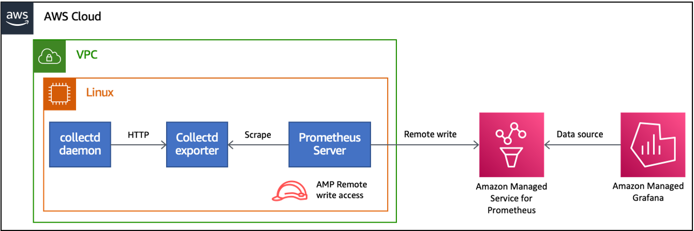
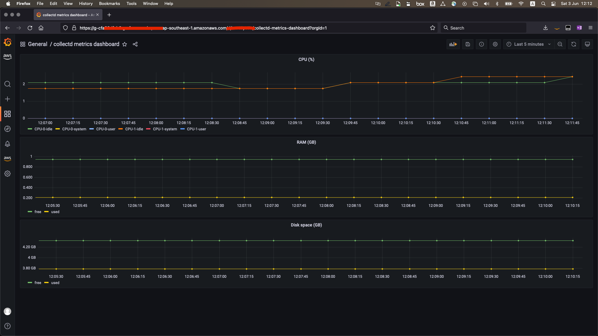

# Demo - `collectd` with Amazon Managed Service for Prometheus and Amazon Managed Grafana

This document has the steps to launch the demo to monitor system metrics gathered by `collectd`. These system metrics are written remotely to Amazon Managed Service for Prometheus and visualized in Amazon Managed Grafana.

> This demo will be launched in Singapore (`ap-southeast-1`) region. This demo has been tested with Amazon EC2 instances running Ubuntu-22.04 operating system.

- [Demo - `collectd` with Amazon Managed Service for Prometheus and Amazon Managed Grafana](#demo---collectd-with-amazon-managed-service-for-prometheus-and-amazon-managed-grafana)
  - [Overview](#overview)
  - [Step 1 - Launch EC2 instance](#step-1---launch-ec2-instance)
  - [Step 2 - Install, configure and launch `collectd`](#step-2---install-configure-and-launch-collectd)
  - [Step 3 - Install Go](#step-3---install-go)
  - [Step 4 - Set-up Amazon Managed Services for Prometheus](#step-4---set-up-amazon-managed-services-for-prometheus)
  - [Step 6 - Install Prometheus server](#step-6---install-prometheus-server)
  - [Step 7 - Set-up Amazon Managed Grafana](#step-7---set-up-amazon-managed-grafana)

## Overview

This demo will implement the architecture diagram shown below.



1. One EC2 instance, named `Linux`, running Ubuntu-22.04 operating system.
2. The `Linux` instance is the system to be monitored with `collectd`.
3. The `collectd` metrics will be gathered, by a Prometheus server, with `collectd_exporter` - [Prometheus official exporter for `collectd`](https://github.com/prometheus/collectd_exporter) - for scraping.
4. The Prometheus server is configured to
   1. Scrape the `collectd_exporter` installed on `Linux` instance.
   2. Write remotely to Amazon Managed Service for Prometheus.
   3. Have an IAM role that allows write remotely to Amazon Managed Service for Prometheus.
5. One workspace each for Amazon Managed Service for Prometheus and Amazon Managed Grafana.
6. Recording rules are configured for Amazon Managed Service for Prometheus.
7. The Amazon Managed Grafana instance is configured to use Amazon Managed Service for Prometheus as a data source.
8. The Amazon Managed Grafana instance has a dashboard configured to display the system metrics gathered via `collectd`.

## Step 1 - Launch EC2 instance
This step will launch an EC2 instance that will be monitored using `collectd`.

1. [Launch and connect to Amazon EC2 instance](https://docs.aws.amazon.com/AWSEC2/latest/UserGuide/EC2_GetStarted.html) named `Linux`.
  1. Region - `ap-southeast-1`. See [here](https://docs.aws.amazon.com/prometheus/latest/userguide/what-is-Amazon-Managed-Service-Prometheus.html#AMP-supported-Regions) for a list of supported regions for Amazon Managed Service for Prometheus.
  2. Instance type - `t2.medium`.
  3. Select option for creating a new key pair.
  4. Security group - `ssh` from your IP address.

## Step 2 - Install, configure and launch `collectd`
The following instructions are to be run after [logging](https://docs.aws.amazon.com/AWSEC2/latest/UserGuide/EC2_GetStarted.html#ec2-connect-to-instance-linux) into EC2 instance.

1. Update operating system and install tools. While installing these tools, you will be presented a GUI. Just `Tab` over to `Ok` and hit `Enter`.

```bash
sudo apt-get update && sudo apt-get install -y build-essential libcurl4-openssl-dev
```

2. Install `collectd` on `Linux` instance.

```bash
export COLLECTD_VERSION=5.12.0
echo "export COLLECTD_VERSION=5.12.0" >> $HOME/.profile
wget https://storage.googleapis.com/collectd-tarballs/collectd-${COLLECTD_VERSION}.tar.bz2
tar xf collectd-${COLLECTD_VERSION}.tar.bz2
cd collectd-${COLLECTD_VERSION}
./configure
sudo make all install
cd $HOME
```

3. Create a file `collectd.conf` as shown below. This file will be used to configure `collectd`.

```bash
FQDNLookup true
Interval 10

LoadPlugin syslog

<Plugin syslog>
    LogLevel info
</Plugin>

LoadPlugin df
LoadPlugin cpu
LoadPlugin memory
LoadPlugin csv
LoadPlugin write_http

<Plugin "cpu">
    ValuesPercentage true
</Plugin>

<Plugin "df">
    IgnoreSelected false
    MountPoint "/"
</Plugin>

<Plugin "csv">
  DataDir "/var/lib/collectd/csv"
  StoreRates true
</Plugin>

<Plugin write_http>
  <Node "collectd_exporter">
    URL "http://localhost:9103/collectd-post"
    Format "JSON"
    StoreRates false
  </Node>
</Plugin>
```

4. Launch `collectd`.

```bash
echo "export PATH=$PATH:$HOME/collectd-${COLLECTD_VERSION}" >> $HOME/.profile
export PATH=$PATH:$HOME/collectd-${COLLECTD_VERSION}
cd $HOME/collectd-${COLLECTD_VERSION}
sudo ./collectd -C $HOME/collectd.conf
cd $HOME
```

5. Check for messages in the folder `/var/lib/collectd/csv/`. In this folder, the subsequent folder structure would be `<ip-host-name>/<plugin-name>`. The name of the file will depend on the metric captured by the plugin and suffixed by date when the metric was captured. For example, the metrics for free memory can be seen at `/var/lib/collectd/csv/ip-172-xx-xx-xxx.ap-southeast-1.compute.internal/memory/memory-free-2023-06-03`. The following values are an example output where, the first value is Unix timestamp and the second is the actual metric value.

```bash
epoch,value
1685765302.763,2899308544.000000
1685765312.754,2899308544.000000
1685765322.754,2899308544.000000
1685765332.754,2899308544.000000
1685765342.754,2899308544.000000
1685765352.754,2899308544.000000
1685765362.754,2899308544.000000
1685765372.754,2899308544.000000
1685765382.754,2899308544.000000
1685765392.754,2899308544.000000
1685765402.754,2899308544.000000
1685765412.755,2899079168.000000
1685765422.754,2899079168.000000
```

## Step 3 - Install Go

1. Install Go on `Linux` instance.

```bash
cd $HOME
export GO_VERSION=17.7
curl -OL https://go.dev/dl/go1.${GO_VERSION}.linux-amd64.tar.gz
sudo tar -C /usr/local -xvf go1.${GO_VERSION}.linux-amd64.tar.gz
echo "export PATH=$PATH:/usr/local/go/bin" >> $HOME/.profile
export PATH=$PATH:/usr/local/go/bin
```

2. Build `collectd_exporter`.

```bash
git clone https://github.com/prometheus/collectd_exporter
cd collectd_exporter
export DOCKER_ARCHS=amd64
make
echo "export PATH=$PATH:$HOME/collectd_exporter" >> $HOME/.profile
export PATH=$PATH:$HOME/collectd_exporter
```

3. Launch `collectd_exporter`.

```bash
collectd_exporter
```

The following logs are seen upon launching `collectd_exporter`.

```bash
collectd_exporter --collectd.listen-address=":25826"
level=info ts=2022-03-03T05:47:46.389Z caller=main.go:323 msg="Starting collectd_exporter" version="(version=0.5.0, branch=master, revision=f81b12fc801d98bb3dcfa11aec4e03f9bbb31e29)"
level=info ts=2022-03-03T05:47:46.389Z caller=main.go:324 msg="Build context" context="(go=go1.17.7, user=ubuntu@ip-172-31-22-27, date=20220303-05:21:09)"
level=info ts=2022-03-03T05:47:46.389Z caller=main.go:346 msg="Listening on address" address=:9103
level=info ts=2022-03-03T05:47:46.389Z caller=tls_config.go:191 msg="TLS is disabled." http2=false
```

## Step 4 - Set-up Amazon Managed Services for Prometheus

The following instructions are to be followed from the AWS console.

1. [Create](https://docs.aws.amazon.com/prometheus/latest/userguide/AMP-onboard-create-workspace.html) the Amazon Managed Service for Prometheus workspace.
2. [Upload](https://docs.aws.amazon.com/prometheus/latest/userguide/AMP-rules-upload.html) recording rules, as shown below, to Amazon Managed Service for Prometheus workspace created earlier.

```yaml
groups:
  - name: collectd
    rules:
    - record: metric:collectd_df_GB
      expr: collectd_df_df_complex/1000000000
    - record: metric:collectd_avg_df_GB
      expr: sum(rate(metric:collect_df_GB[5m])) by (type)
    - record: metric:collectd_memory_GB
      expr: collectd_memory/1000000000
    - record: metric:collectd_avg_memory_GB
      expr: sum(rate(collectd_memory_GB[5m])) by (memory)
    - record: metric:collectd_cpu_percent
      expr: sum(rate(collectd_cpu_percent[5m])) by (cpu, type)
```

3. [Create](https://docs.aws.amazon.com/IAM/latest/UserGuide/id_roles_create_for-service.html) an IAM role with the `AmazonPrometheusRemoteWriteAccess` policy and [attach](https://docs.aws.amazon.com/AWSEC2/latest/UserGuide/iam-roles-for-amazon-ec2.html#attach-iam-role) the role to the Amazon EC2 instance.

## Step 6 - Install Prometheus server

1. Open another terminal [connection](https://docs.aws.amazon.com/AWSEC2/latest/UserGuide/EC2_GetStarted.html#ec2-connect-to-instance-linux) to `Linux` EC2 instance.
2. Install Prometheus server and set-up environment variables.

```bash
export PROMETHEUS_VERSION=2.34.0
curl -sOL https://github.com/prometheus/prometheus/releases/download/v${PROMETHEUS_VERSION}-rc.0/prometheus-${PROMETHEUS_VERSION}-rc.0.linux-amd64.tar.gz
tar xvzf prometheus-${PROMETHEUS_VERSION}-rc.0.linux-amd64.tar.gz
export PATH=$PATH:$HOME/prometheus-${PROMETHEUS_VERSION}-rc.0.linux-amd64
echo "export PROMETHEUS_VERSION=2.34.0" >> $HOME/.profile
echo "export PATH=$PATH:$HOME/prometheus-${PROMETHEUS_VERSION}-rc.0.linux-amd64" >> $HOME/.profile
```

2. Create a configuration file for Prometheus using contents below and save as `prometheus.yaml`. Use `<workspaceId>` from the workspace created in Step 4. Use `regionId` as `ap-southeast-1`.

```yaml
global:
  scrape_interval: 15s
  external_labels:
    monitor: 'collectd_exporter'

scrape_configs:
  - job_name: 'collectd_exporter'
    static_configs:
      - targets: ['localhost:9103']

remote_write:
  -
    url: https://aps-workspaces.<regionId>.amazonaws.com/workspaces/<workspaceId>/api/v1/remote_write
    queue_config:
        max_samples_per_send: 1000
        max_shards: 200
        capacity: 2500
    sigv4:
        region: <regionId>
```

3. Launch Prometheus.

```bash
prometheus --config.file=prometheus.yaml
```

You should see the following logs.

```bash
ts=2022-07-24T22:43:13.576Z caller=main.go:476 level=info msg="No time or size retention was set so using the default time retention" duration=15d
ts=2022-07-24T22:43:13.576Z caller=main.go:513 level=info msg="Starting Prometheus" version="(version=2.34.0-rc.0, branch=HEAD, revision=e25a5992555527d26e53ea4d24e1b8bf16528c58)"
ts=2022-07-24T22:43:13.576Z caller=main.go:518 level=info build_context="(go=go1.17.7, user=root@6cedbbd2ba09, date=20220228-15:42:03)"
ts=2022-07-24T22:43:13.576Z caller=main.go:519 level=info host_details="(Linux 5.15.0-1011-aws #14-Ubuntu SMP Wed Jun 1 20:54:22 UTC 2022 x86_64 ip-172-31-18-96 (none))"
ts=2022-07-24T22:43:13.576Z caller=main.go:520 level=info fd_limits="(soft=1024, hard=1048576)"
ts=2022-07-24T22:43:13.576Z caller=main.go:521 level=info vm_limits="(soft=unlimited, hard=unlimited)"
ts=2022-07-24T22:43:13.578Z caller=web.go:540 level=info component=web msg="Start listening for connections" address=0.0.0.0:9090
ts=2022-07-24T22:43:13.579Z caller=main.go:934 level=info msg="Starting TSDB ..."
ts=2022-07-24T22:43:13.582Z caller=tls_config.go:195 level=info component=web msg="TLS is disabled." http2=false
ts=2022-07-24T22:43:13.586Z caller=head.go:493 level=info component=tsdb msg="Replaying on-disk memory mappable chunks if any"
ts=2022-07-24T22:43:13.586Z caller=head.go:536 level=info component=tsdb msg="On-disk memory mappable chunks replay completed" duration=5.093µs
ts=2022-07-24T22:43:13.586Z caller=head.go:542 level=info component=tsdb msg="Replaying WAL, this may take a while"
ts=2022-07-24T22:43:13.586Z caller=head.go:613 level=info component=tsdb msg="WAL segment loaded" segment=0 maxSegment=0
ts=2022-07-24T22:43:13.587Z caller=head.go:619 level=info component=tsdb msg="WAL replay completed" checkpoint_replay_duration=43.621µs wal_replay_duration=293.707µs total_replay_duration=472.991µs
ts=2022-07-24T22:43:13.588Z caller=main.go:955 level=info fs_type=EXT4_SUPER_MAGIC
ts=2022-07-24T22:43:13.588Z caller=main.go:958 level=info msg="TSDB started"
ts=2022-07-24T22:43:13.588Z caller=main.go:1139 level=info msg="Loading configuration file" filename=prometheus.yaml
ts=2022-07-24T22:43:13.596Z caller=dedupe.go:112 component=remote level=info remote_name=2156e9 url=https://aps-workspaces.ap-southeast-1.amazonaws.com/workspaces/ws-191a9a06-efa9-4441-bff3-65d6a9372fcc/api/v1/remote_write msg="Starting WAL watcher" queue=2156e9
ts=2022-07-24T22:43:13.596Z caller=dedupe.go:112 component=remote level=info remote_name=2156e9 url=https://aps-workspaces.ap-southeast-1.amazonaws.com/workspaces/ws-191a9a06-efa9-4441-bff3-65d6a9372fcc/api/v1/remote_write msg="Starting scraped metadata watcher"
ts=2022-07-24T22:43:13.596Z caller=dedupe.go:112 component=remote level=info remote_name=2156e9 url=https://aps-workspaces.ap-southeast-1.amazonaws.com/workspaces/ws-191a9a06-efa9-4441-bff3-65d6a9372fcc/api/v1/remote_write msg="Replaying WAL" queue=2156e9
ts=2022-07-24T22:43:13.601Z caller=main.go:1176 level=info msg="Completed loading of configuration file" filename=prometheus.yaml totalDuration=13.011172ms db_storage=1.584µs remote_storage=7.480765ms web_handler=1.495µs query_engine=1.808µs scrape=5.116067ms scrape_sd=46.547µs notify=2.442µs notify_sd=3.899µs rules=2.59µs tracing=10.092µs
ts=2022-07-24T22:43:13.601Z caller=main.go:907 level=info msg="Server is ready to receive web requests."
```

## Step 7 - Set-up Amazon Managed Grafana

The following instructions are to be followed from the AWS console.

1. [Create](https://catalog.workshops.aws/observability/en-US/amg/setupamg-saml) an Amazon Managed Grafana workspace with SAML user access.
2. [Add](https://docs.aws.amazon.com/grafana/latest/userguide/prometheus-data-source.html) the Amazon Managed Service for Prometheus data source.
3. Click on **Go to settings** and change the **Name** to `ec2-collectd`.
4. [Create](https://docs.aws.amazon.com/grafana/latest/userguide/dashboard-export-and-import.html#importing-a-dashboard) a new dashboard with the Import option.
5. Copy the following JSON document into a file and [upload](https://docs.aws.amazon.com/grafana/latest/userguide/dashboard-export-and-import.html#importing-a-dashboard) it to create a new dashboard.

```json
{"annotations":{"list":[{"builtIn":1,"datasource":"ec2-collectd","enable":true,"hide":true,"iconColor":"rgba(0, 211, 255, 1)","name":"Annotations & Alerts","target":{"limit":100,"matchAny":false,"tags":[],"type":"dashboard"},"type":"dashboard"}]},"description":"Linux system metrics","editable":true,"fiscalYearStartMonth":0,"graphTooltip":0,"id":68,"links":[],"liveNow":true,"panels":[{"datasource":{"type":"prometheus","uid":"Wn68fi_4k"},"fieldConfig":{"defaults":{"color":{"mode":"palette-classic"},"custom":{"axisLabel":"","axisPlacement":"auto","barAlignment":0,"drawStyle":"line","fillOpacity":0,"gradientMode":"none","hideFrom":{"legend":false,"tooltip":false,"viz":false},"lineInterpolation":"linear","lineWidth":1,"pointSize":5,"scaleDistribution":{"type":"linear"},"showPoints":"auto","spanNulls":false,"stacking":{"group":"A","mode":"none"},"thresholdsStyle":{"mode":"off"}},"mappings":[],"thresholds":{"mode":"absolute","steps":[{"color":"green","value":null},{"color":"red","value":80}]}},"overrides":[]},"gridPos":{"h":7,"w":24,"x":0,"y":0},"id":6,"options":{"legend":{"calcs":[],"displayMode":"list","placement":"bottom"},"tooltip":{"mode":"single","sort":"none"}},"targets":[{"datasource":{"type":"prometheus","uid":"Wn68fi_4k"},"exemplar":true,"expr":"metric:collectd_cpu_percent{cpu=~\"0|1\",type=~\"user|idle|system\"}","interval":"","legendFormat":"{{type}}","refId":"A"}],"title":"CPU (%)","type":"timeseries"},{"datasource":{"type":"prometheus","uid":"Wn68fi_4k"},"fieldConfig":{"defaults":{"color":{"mode":"palette-classic"},"custom":{"axisLabel":"","axisPlacement":"auto","barAlignment":0,"drawStyle":"line","fillOpacity":0,"gradientMode":"none","hideFrom":{"legend":false,"tooltip":false,"viz":false},"lineInterpolation":"linear","lineWidth":1,"pointSize":5,"scaleDistribution":{"type":"linear"},"showPoints":"auto","spanNulls":false,"stacking":{"group":"A","mode":"none"},"thresholdsStyle":{"mode":"off"}},"mappings":[],"thresholds":{"mode":"absolute","steps":[{"color":"green","value":null},{"color":"red","value":80}]}},"overrides":[]},"gridPos":{"h":7,"w":24,"x":0,"y":7},"id":4,"options":{"legend":{"calcs":[],"displayMode":"list","placement":"bottom"},"tooltip":{"mode":"single","sort":"none"}},"targets":[{"datasource":{"type":"prometheus","uid":"Wn68fi_4k"},"exemplar":true,"expr":"metric:collectd_memory_GB{memory=~\"used|free\"}","interval":"","legendFormat":"{{memory}}","refId":"A"}],"title":"RAM (GB)","type":"timeseries"},{"datasource":{"type":"prometheus","uid":"Wn68fi_4k"},"fieldConfig":{"defaults":{"color":{"mode":"palette-classic"},"custom":{"axisLabel":"","axisPlacement":"auto","barAlignment":0,"drawStyle":"line","fillOpacity":0,"gradientMode":"none","hideFrom":{"legend":false,"tooltip":false,"viz":false},"lineInterpolation":"linear","lineWidth":1,"pointSize":5,"scaleDistribution":{"type":"linear"},"showPoints":"auto","spanNulls":false,"stacking":{"group":"A","mode":"none"},"thresholdsStyle":{"mode":"off"}},"mappings":[],"thresholds":{"mode":"absolute","steps":[{"color":"green","value":null},{"color":"red","value":80}]},"unit":"decgbytes"},"overrides":[]},"gridPos":{"h":6,"w":24,"x":0,"y":14},"id":2,"options":{"legend":{"calcs":[],"displayMode":"list","placement":"bottom"},"tooltip":{"mode":"single","sort":"none"}},"targets":[{"datasource":{"type":"prometheus","uid":"Wn68fi_4k"},"exemplar":true,"expr":"metric:collectd_df_GB{df=\"root\",type=~\"used|free\"}","interval":"","legendFormat":"{{type}}","refId":"A"}],"title":"Disk space (GB)","type":"timeseries"}],"refresh":"","schemaVersion":35,"style":"dark","tags":[],"templating":{"list":[]},"time":{"from":"now-5m","to":"now"},"timepicker":{},"timezone":"","title":"collectd metrics dashboard","uid":"tuv47pY7z","version":1,"weekStart":"monday"}
```

6.  Dashboard is live!


