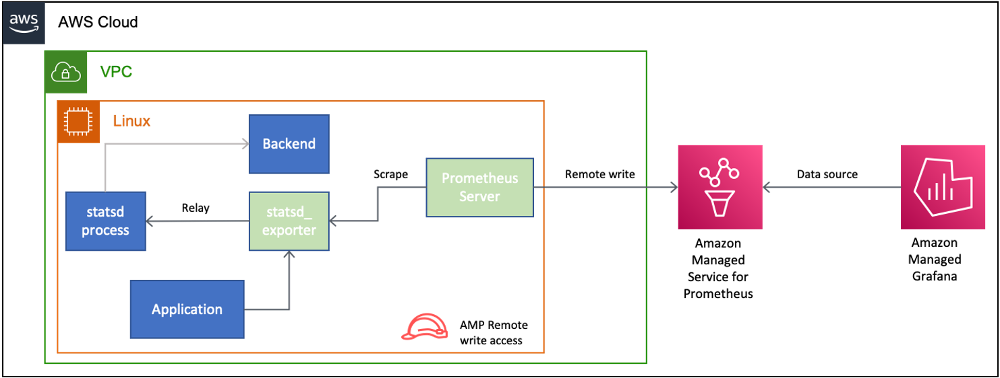
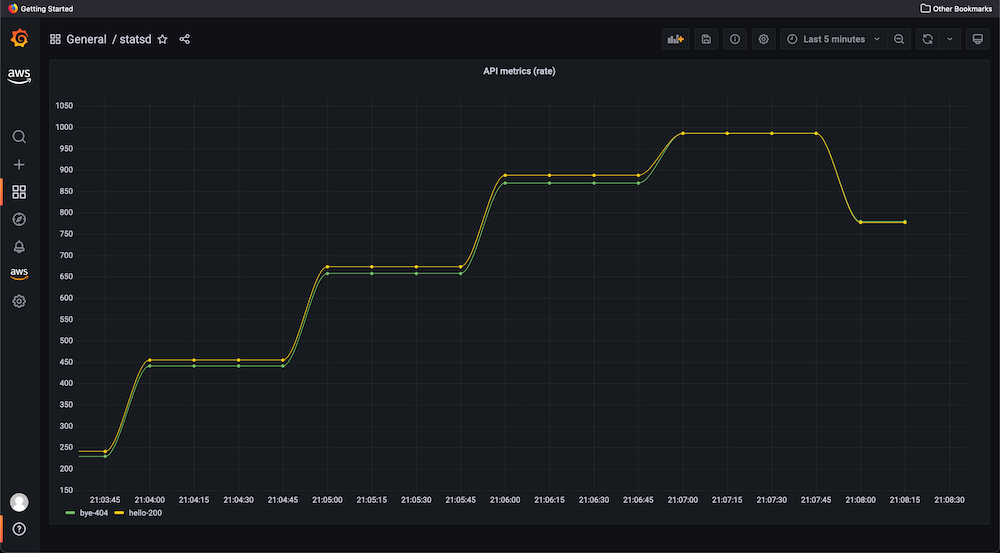

# Demo - `statsd` with Amazon Managed Service for Prometheus and Amazon Managed Grafana - Relay mode

This document has the steps to launch the demo to monitor custom metrics gathered by `statsd`. These custom metrics are written remotely to Amazon Managed Service for Prometheus and visualized in Amazon Managed Grafana.

> This demo will be launched in Singapore (`ap-southeast-1`) region. This demo has been tested with Amazon EC2 instances running Ubuntu-22.04 operating system.
 
- [Demo - `statsd` with Amazon Managed Service for Prometheus and Amazon Managed Grafana - Relay mode](#demo---statsd-with-amazon-managed-service-for-prometheus-and-amazon-managed-grafana---relay-mode)
  - [Overview](#overview)
  - [Step 1 - Launch EC2 instance](#step-1---launch-ec2-instance)
  - [Step 2 - Install, configure and launch `statsd` in Relay mode](#step-2---install-configure-and-launch-statsd-in-relay-mode)
  - [Step 3 - Set-up Amazon Managed Services for Prometheus](#step-3---set-up-amazon-managed-services-for-prometheus)
  - [Step 4 - Install, configure and launch Prometheus server](#step-4---install-configure-and-launch-prometheus-server)
  - [Step 5 - Launch NodeJs application](#step-5---launch-nodejs-application)
  - [Step 7 - Install `hey` to simulate clients](#step-7---install-hey-to-simulate-clients)
  - [Step 8 - Set-up Amazon Managed Grafana](#step-8---set-up-amazon-managed-grafana)

## Overview

This demo will implement the architecture diagram shown below.



1. One EC2 instance will be launched named as `Linux`. Open port `4000` from your local environment to test API invocation.
2. The `statsd` metrics will be gathered by a Prometheus server.
3. The Prometheus server is configured to
   1. Scrape the `statsd_exporter` installed on `Linux` instance.
   2. Write remotely to Amazon Managed Service for Prometheus.
   3. Have an IAM role that allows write remotely to Amazon Managed Service for Prometheus.
4. One workspace each for Amazon Managed Service for Prometheus and Amazon Managed Grafana.
5. Recording rules are configured for Amazon Managed Service for Prometheus.
6. The Amazon Managed Grafana instance is configured to use Amazon Managed Service for Prometheus as a data source.
7. The Amazon Managed Grafana instance has a dashboard configured to display the system metrics gathered via `statsd`.

## Step 1 - Launch EC2 instance

This step will launch EC2 instances.

1. [Launch and connect to Amazon EC2 instance](https://docs.aws.amazon.com/AWSEC2/latest/UserGuide/EC2_GetStarted.html) named `Linux`.
  1. Region - `ap-southeast-1`. See [here](https://docs.aws.amazon.com/prometheus/latest/userguide/what-is-Amazon-Managed-Service-Prometheus.html#AMP-supported-Regions) for a list of supported regions for Amazon Managed Service for Prometheus.
  2. Instance type - `t2.medium`.
  3. Select option for creating a new key pair.
  4. Security group - `ssh` and port `4000` from your IP address.

## Step 2 - Install, configure and launch `statsd` in Relay mode

The following instructions are to be run after [logging](https://docs.aws.amazon.com/AWSEC2/latest/UserGuide/EC2_GetStarted.html#ec2-connect-to-instance-linux) into EC2 instance named `Linux`.

1. Install NodeJs

```bash
sudo apt-get update
curl -fsSL https://deb.nodesource.com/setup_18.x | sudo -E bash -
sudo apt-get install -y nodejs
```

2. Install `statsd`

```bash
git clone https://github.com/statsd/statsd
cd statsd
npm i
cd $HOME
```

3. Save the following into `$HOME/statsd-config.js`.

```js
{
 backends: [ "./backends/console" ]
}
```

4. Install and launch `statsd_exporter`

```bash
cd $HOME
curl -sOL https://github.com/prometheus/statsd_exporter/releases/download/v0.22.4/statsd_exporter-0.22.4.linux-amd64.tar.gz
tar -xvf statsd_exporter-0.22.4.linux-amd64.tar.gz
cd statsd_exporter-0.22.4.linux-amd64
cd $HOME
```

5. Save the following into `$HOME/statsd-mapping-config.yaml`

```yaml
mappings:
- match: "api.*.*.*"
  name: "api_metrics"
  labels:
    path: "$1"
    method: "$2"
    status: "$3"
```

6. Launch `statsd_exporter`

```bash
cd $HOME
statsd_exporter-0.22.4.linux-amd64/statsd_exporter --statsd.mapping-config=statsd-mapping-config.yaml --statsd.relay.address=localhost:8125
```

7. Open a new [connection](https://docs.aws.amazon.com/AWSEC2/latest/UserGuide/EC2_GetStarted.html#ec2-connect-to-instance-linux) to the EC2 instance named `Linux` and run the following command to start `statsd`.

```bash
cd $HOME/statsd
node stats.js $HOME/statsd-config.js
```

## Step 3 - Set-up Amazon Managed Services for Prometheus

The following instructions are to be followed from the AWS console.

1. [Create](https://docs.aws.amazon.com/prometheus/latest/userguide/AMP-onboard-create-workspace.html) the Amazon Managed Service for Prometheus workspace.
2. [Upload](https://docs.aws.amazon.com/prometheus/latest/userguide/AMP-rules-upload.html) recording rules, as shown below, to Amazon Managed Service for Prometheus workspace created earlier.

```yaml
groups:
  - name: statsd
    rules:
    - record: metric:api_metrics
      expr: sum(rate(api_metrics[5m])) by (path, status)
```

## Step 4 - Install, configure and launch Prometheus server

Open a new [connection](https://docs.aws.amazon.com/AWSEC2/latest/UserGuide/EC2_GetStarted.html#ec2-connect-to-instance-linux) to the EC2 instance named `Linux` and run the following command to launch Prometheus.

1. Install Prometheus server

```bash
sudo apt-get update
export PROMETHEUS_VERSION=2.34.0
curl -sOL https://github.com/prometheus/prometheus/releases/download/v${PROMETHEUS_VERSION}-rc.0/prometheus-${PROMETHEUS_VERSION}-rc.0.linux-amd64.tar.gz
tar xvzf prometheus-${PROMETHEUS_VERSION}-rc.0.linux-amd64.tar.gz
export PATH=$PATH:$HOME/prometheus-${PROMETHEUS_VERSION}-rc.0.linux-amd64
echo "export PROMETHEUS_VERSION=2.34.0" >> $HOME/.profile
echo "export PATH=$PATH:$HOME/prometheus-${PROMETHEUS_VERSION}-rc.0.linux-amd64" >> $HOME/.profile
```

2. Copy the following into `prometheus.yaml` to configure Prometheus server. Use `<workspaceId>` from the workspace created in Step 3. Use `regionId` as `ap-southeast-1`.

```yaml
global:
  scrape_interval: 15s
  external_labels:
    monitor: 'statsd_exporter'

scrape_configs:
  - job_name: 'statsd_exporter'
    static_configs:
      - targets: ['localhost:9102']
 
remote_write:
  -
    url: https://aps-workspaces.<regionId>.amazonaws.com/workspaces/<workspaceId>/api/v1/remote_write
    queue_config:
        max_samples_per_send: 1000
        max_shards: 200
        capacity: 2500
    sigv4:
        region: <regionId>
```
3. Launch Prometheus.

```bash
prometheus --config.file=prometheus.yaml
```

You should see the following logs.

```bash
ts=2022-07-24T22:43:13.576Z caller=main.go:476 level=info msg="No time or size retention was set so using the default time retention" duration=15d
ts=2022-07-24T22:43:13.576Z caller=main.go:513 level=info msg="Starting Prometheus" version="(version=2.34.0-rc.0, branch=HEAD, revision=e25a5992555527d26e53ea4d24e1b8bf16528c58)"
ts=2022-07-24T22:43:13.576Z caller=main.go:518 level=info build_context="(go=go1.17.7, user=root@6cedbbd2ba09, date=20220228-15:42:03)"
ts=2022-07-24T22:43:13.576Z caller=main.go:519 level=info host_details="(Linux 5.15.0-1011-aws #14-Ubuntu SMP Wed Jun 1 20:54:22 UTC 2022 x86_64 ip-172-31-18-96 (none))"
ts=2022-07-24T22:43:13.576Z caller=main.go:520 level=info fd_limits="(soft=1024, hard=1048576)"
ts=2022-07-24T22:43:13.576Z caller=main.go:521 level=info vm_limits="(soft=unlimited, hard=unlimited)"
ts=2022-07-24T22:43:13.578Z caller=web.go:540 level=info component=web msg="Start listening for connections" address=0.0.0.0:9090
ts=2022-07-24T22:43:13.579Z caller=main.go:934 level=info msg="Starting TSDB ..."
ts=2022-07-24T22:43:13.582Z caller=tls_config.go:195 level=info component=web msg="TLS is disabled." http2=false
ts=2022-07-24T22:43:13.586Z caller=head.go:493 level=info component=tsdb msg="Replaying on-disk memory mappable chunks if any"
ts=2022-07-24T22:43:13.586Z caller=head.go:536 level=info component=tsdb msg="On-disk memory mappable chunks replay completed" duration=5.093µs
ts=2022-07-24T22:43:13.586Z caller=head.go:542 level=info component=tsdb msg="Replaying WAL, this may take a while"
ts=2022-07-24T22:43:13.586Z caller=head.go:613 level=info component=tsdb msg="WAL segment loaded" segment=0 maxSegment=0
ts=2022-07-24T22:43:13.587Z caller=head.go:619 level=info component=tsdb msg="WAL replay completed" checkpoint_replay_duration=43.621µs wal_replay_duration=293.707µs total_replay_duration=472.991µs
ts=2022-07-24T22:43:13.588Z caller=main.go:955 level=info fs_type=EXT4_SUPER_MAGIC
ts=2022-07-24T22:43:13.588Z caller=main.go:958 level=info msg="TSDB started"
ts=2022-07-24T22:43:13.588Z caller=main.go:1139 level=info msg="Loading configuration file" filename=prometheus.yaml
ts=2022-07-24T22:43:13.596Z caller=dedupe.go:112 component=remote level=info remote_name=2156e9 url=https://aps-workspaces.ap-southeast-1.amazonaws.com/workspaces/ws-191a9a06-efa9-4441-bff3-65d6a9372fcc/api/v1/remote_write msg="Starting WAL watcher" queue=2156e9
ts=2022-07-24T22:43:13.596Z caller=dedupe.go:112 component=remote level=info remote_name=2156e9 url=https://aps-workspaces.ap-southeast-1.amazonaws.com/workspaces/ws-191a9a06-efa9-4441-bff3-65d6a9372fcc/api/v1/remote_write msg="Starting scraped metadata watcher"
ts=2022-07-24T22:43:13.596Z caller=dedupe.go:112 component=remote level=info remote_name=2156e9 url=https://aps-workspaces.ap-southeast-1.amazonaws.com/workspaces/ws-191a9a06-efa9-4441-bff3-65d6a9372fcc/api/v1/remote_write msg="Replaying WAL" queue=2156e9
ts=2022-07-24T22:43:13.601Z caller=main.go:1176 level=info msg="Completed loading of configuration file" filename=prometheus.yaml totalDuration=13.011172ms db_storage=1.584µs remote_storage=7.480765ms web_handler=1.495µs query_engine=1.808µs scrape=5.116067ms scrape_sd=46.547µs notify=2.442µs notify_sd=3.899µs rules=2.59µs tracing=10.092µs
ts=2022-07-24T22:43:13.601Z caller=main.go:907 level=info msg="Server is ready to receive web requests."
```

## Step 5 - Launch NodeJs application

Open a new [connection](https://docs.aws.amazon.com/AWSEC2/latest/UserGuide/EC2_GetStarted.html#ec2-connect-to-instance-linux) to the EC2 instance named `Linux` and run the following commands to launch a sample NodeJs application.

1. Set-up for creating the Nodejs application.

```bash
mkdir app
cd app
npm init -y
npm i express node-statsd --save
```

2. Copy the following into `app/index.js`.

```js
const express = require('express')
const StatsD = require('node-statsd')

const statsdClient = new StatsD({
  host: "localhost",
  port: 9125
})

const app = express()
const port = 4000

let incrVar

app.get('/hello', (req, res) => {
  incrVar = `${req.path}.${req.method}.200`
  incrVar = `api.${incrVar.substring(1)}`
  statsdClient.increment(incrVar)

  res.status(200).send('Hello World!')
})

app.use('/', (req, res) => {
  incrVar = `${req.path}.${req.method}.404`
  incrVar = `api.${incrVar.substring(1)}`
  statsdClient.increment(incrVar)

  res.status(404).send('Not found.')
})

app.listen(port, () => {
  console.log(`Example app listening on port ${port}`)
})
```

3. Launch the NodeJs application with the following commands.

```bash
cd $HOME/app
node index.js
```

## Step 7 - Install `hey` to simulate clients

On your local environment, install `hey` following instructions from [GitHub repository](https://github.com/rakyll/hey).

1. Open two terminal instances on your local environment.
2. Run the following commands.

```bash
hey -z 5m http://ec2-public-ip:4000/hello
hey -z 5m http://ec2-public-ip:4000/bye
```

## Step 8 - Set-up Amazon Managed Grafana

The following instructions are to be followed from the AWS console for launching Amazon Managed Grafana instance.

1. [Create](https://catalog.workshops.aws/observability/en-US/amg/setupamg-saml) an Amazon Managed Grafana workspace with SAML user access.
2. [Add](https://docs.aws.amazon.com/grafana/latest/userguide/prometheus-data-source.html) the Amazon Managed Service for Prometheus data source.
3. Click on **Go to settings** and change the **Name** to `ec2-statsd`.
4. [Create](https://docs.aws.amazon.com/grafana/latest/userguide/dashboard-export-and-import.html#importing-a-dashboard) a new dashboard with the Import option.
5. Copy the following JSON document into a file and [upload](https://docs.aws.amazon.com/grafana/latest/userguide/dashboard-export-and-import.html#importing-a-dashboard) it to create a new dashboard.

```json
{"annotations":{"list":[{"builtIn":1,"datasource":"ec2-statsd","enable":true,"hide":true,"iconColor":"rgba(0, 211, 255, 1)","name":"Annotations & Alerts","target":{"limit":100,"matchAny":false,"tags":[],"type":"dashboard"},"type":"dashboard"}]},"editable":true,"fiscalYearStartMonth":0,"graphTooltip":0,"id":43,"links":[],"liveNow":true,"panels":[{"datasource":{"type":"prometheus","uid":"bqVqqm_4z"},"fieldConfig":{"defaults":{"color":{"mode":"palette-classic"},"custom":{"axisLabel":"","axisPlacement":"auto","barAlignment":0,"drawStyle":"line","fillOpacity":0,"gradientMode":"none","hideFrom":{"legend":false,"tooltip":false,"viz":false},"lineInterpolation":"smooth","lineWidth":1,"pointSize":5,"scaleDistribution":{"type":"linear"},"showPoints":"auto","spanNulls":false,"stacking":{"group":"A","mode":"none"},"thresholdsStyle":{"mode":"off"}},"mappings":[],"thresholds":{"mode":"absolute","steps":[{"color":"green","value":null},{"color":"red","value":80}]}},"overrides":[]},"gridPos":{"h":19,"w":24,"x":0,"y":0},"id":2,"options":{"legend":{"calcs":[],"displayMode":"list","placement":"bottom"},"tooltip":{"mode":"single","sort":"none"}},"targets":[{"datasource":{"type":"prometheus","uid":"bqVqqm_4z"},"exemplar":true,"expr":"metric:api_metrics{path=~\"bye|hello\"}","interval":"","legendFormat":"{{path}}-{{status}}","refId":"A"}],"title":"API metrics (rate)","type":"timeseries"}],"refresh":"5s","schemaVersion":35,"style":"dark","tags":[],"templating":{"list":[]},"time":{"from":"now-5m","to":"now"},"timepicker":{},"timezone":"browser","title":"statsd","uid":"5fn7dTY7z","version":1,"weekStart":""}
```

6.  Dashboard is live!


