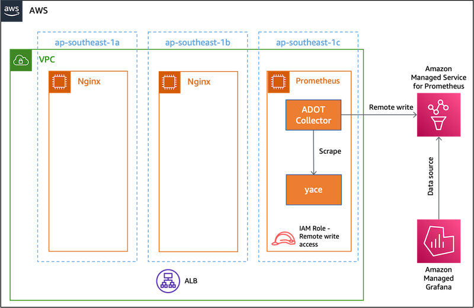
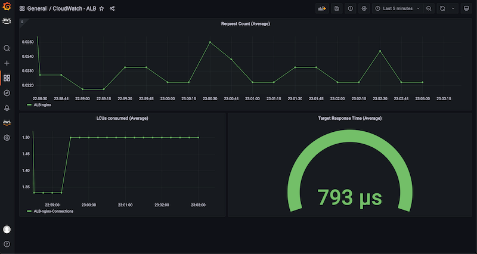

# Demo - `yace` with Amazon Managed Service for Prometheus and Amazon Managed Grafana

This document has the steps to launch the demo to monitor Amazon CloudWatch metrics for Elastic Load Balancer (ELB) gathered by [`yace`](https://github.com/nerdswords/yet-another-cloudwatch-exporter). These metrics are written remotely to Amazon Managed Service for Prometheus and visualized in Amazon Managed Grafana.

> This demo will be launched in Singapore (`ap-southeast-1`) region. This demo has been tested with Amazon EC2 instances running Ubuntu-22.04 operating system.

- [Demo - `yace` with Amazon Managed Service for Prometheus and Amazon Managed Grafana](#demo---yace-with-amazon-managed-service-for-prometheus-and-amazon-managed-grafana)
  - [Overview](#overview)
  - [Step 1 - Launch EC2 instances](#step-1---launch-ec2-instances)
  - [Step 2 - Install and launch `nginx`](#step-2---install-and-launch-nginx)
  - [Step 3 - Set-up ALB](#step-3---set-up-alb)
  - [Step 4 - Create IAM objects](#step-4---create-iam-objects)
  - [Step 5 - Install, configure and launch `yace`](#step-5---install-configure-and-launch-yace)
  - [Step 6 - Set-up Amazon Managed Services for Prometheus](#step-6---set-up-amazon-managed-services-for-prometheus)
  - [Step 7 - Install, configure and launch ADOT server](#step-7---install-configure-and-launch-adot-server)
  - [Step 8 - Install `hey` to simulate client](#step-8---install-hey-to-simulate-client)
  - [Step 9 - Set-up Amazon Managed Grafana](#step-9---set-up-amazon-managed-grafana)

## Overview

This demo will implement the architecture diagram shown below.



1. Three EC2 instances, named `nginx-1`, `nginx-2` and `Prometheus` running Ubuntu-22.04 operating system.
2. An Application Load Balancer (ALB) will forward traffic to `nginx-1` and `nginx-2`.
3. The ALB metrics will be published to Amazon CloudWatch and pulled in by `yace`
4. `yace` will be scraped by [AWS Distro for Open Telemetry (ADOT)](https://aws.amazon.com/otel/).
5. The ADOT server is configured to
   1. Scrape `yace`.
   2. Write remotely to Amazon Managed Service for Prometheus.
   3. Have an IAM role that allows write remotely to Amazon Managed Service for Prometheus.
6. One workspace each for Amazon Managed Service for Prometheus and Amazon Managed Grafana.
7. Recording rules are configured for Amazon Managed Service for Prometheus.
8. The Amazon Managed Grafana instance is configured to use Amazon Managed Service for Prometheus as a data source.
9.  The Amazon Managed Grafana instance has a dashboard configured to display the system metrics gathered via `collectd`.

## Step 1 - Launch EC2 instances

This step will launch EC2 instances. **The names of instances should be set-up exactly as mentioned in the instructions below.**

1. [Launch and connect to Amazon EC2 instance](https://docs.aws.amazon.com/AWSEC2/latest/UserGuide/EC2_GetStarted.html) named `nginx-1`.
  1. Region - `ap-southeast-1`. See [here](https://docs.aws.amazon.com/prometheus/latest/userguide/what-is-Amazon-Managed-Service-Prometheus.html#AMP-supported-Regions) for a list of supported regions for Amazon Managed Service for Prometheus.
  2. Instance type - `t2.medium`.
  3. Select option for creating a new key pair.
  4. Security group - `ssh` from your IP address.
2. [Launch and connect to Amazon EC2 instance](https://docs.aws.amazon.com/AWSEC2/latest/UserGuide/EC2_GetStarted.html) named `nginx-2`.
  1. Region - `ap-southeast-1`. See [here](https://docs.aws.amazon.com/prometheus/latest/userguide/what-is-Amazon-Managed-Service-Prometheus.html#AMP-supported-Regions) for a list of supported regions for Amazon Managed Service for Prometheus.
  2. Instance type - `t2.medium`.
  3. Select option for creating a new key pair.
  4. Security group - `ssh` from your IP address.
3. [Launch and connect to Amazon EC2 instance](https://docs.aws.amazon.com/AWSEC2/latest/UserGuide/EC2_GetStarted.html) named `prometheus`.
  1. Region - `ap-southeast-1`. See [here](https://docs.aws.amazon.com/prometheus/latest/userguide/what-is-Amazon-Managed-Service-Prometheus.html#AMP-supported-Regions) for a list of supported regions for Amazon Managed Service for Prometheus.
  2. Instance type - `t2.medium`.
  3. Select option for creating a new key pair.
  4. Security group - `ssh` from your IP address.

## Step 2 - Install and launch `nginx`

The following instructions are to be run after [logging](https://docs.aws.amazon.com/AWSEC2/latest/UserGuide/EC2_GetStarted.html#ec2-connect-to-instance-linux) into EC2 instances - `nginx-1` and `nginx-2`.

1. Update operating system and install `nginx`.

```bash
sudo apt update
sudo apt install -y nginx
sudo ufw enable
sudo ufw allow 'Nginx HTTP'
```

## Step 3 - Set-up ALB

1. On your local environment with AWS CLI installed, run the following commands to launch and configure an ALB for the Nginx instances. These commands will also configure Nginx instances to receive traffic from ALB. Run `aws configure` command to set region to `ap-southeast-1`.

2. Get default VPC and its subnets.

```bash
DEFAULT_VPC_ID=`aws ec2 describe-vpcs --filters Name=is-default,Values=true --query "Vpcs[0].VpcId" --output text`
VPC_SUBNETS=(`aws ec2 describe-subnets --filter Name=vpc-id,Values=${DEFAULT_VPC_ID} Name=availability-zone,Values=ap-southeast-1a,ap-southeast-1b,ap-southeast-1c --query "Subnets[*].SubnetId" --output text`)
```

3. Create security group for ALB with an inbound rule for internet traffic.

```bash
ALB_SEC_GRP=`aws ec2 create-security-group --description 'Security group for ALB' --group-name alb-nginx --vpc-id ${DEFAULT_VPC_ID} --query "GroupId" --output text`
aws ec2 authorize-security-group-ingress --group-name alb-nginx --protocol tcp --port 80 --cidr 0.0.0.0/0
```

4. Create ALB, target group, listener and register `nginx` instances.

```bash
ALB_ARN=`aws elbv2 create-load-balancer --name nginx --subnets ${VPC_SUBNETS} --security-groups ${ALB_SEC_GRP} --query "LoadBalancers[0].LoadBalancerArn" --output text`
ALB_TARGET_GRP_ARN=`aws elbv2 create-target-group --name nginx --protocol HTTP --port 80 --vpc-id ${DEFAULT_VPC_ID} --query "TargetGroups[0].TargetGroupArn" --output text`
EC2_ID_1=`aws ec2 describe-instances --filters Name=tag:Name,Values=nginx-1 Name=instance-state-name,Values=running --query "Reservations[0].Instances[0].InstanceId" --output text`
EC2_ID_2=`aws ec2 describe-instances --filters Name=tag:Name,Values=nginx-2 Name=instance-state-name,Values=running --query "Reservations[0].Instances[0].InstanceId" --output text`
aws elbv2 register-targets --target-group-arn ${ALB_TARGET_GRP_ARN} --targets Id=${EC2_ID_1} Id=${EC2_ID_2}
aws elbv2 create-listener --load-balancer-arn ${ALB_ARN} --protocol HTTP --port 80 --default-actions Type=forward,TargetGroupArn=${ALB_TARGET_GRP_ARN}
```

5. Configure security group of `nginx` instances to receive traffic from ALB only.

```bash
EC2_SEC_GRP=`aws ec2 create-security-group --description 'ALB to Nginx' --group-name alb-ec2 --vpc-id ${DEFAULT_VPC_ID} --query "GroupId" --output text`
aws ec2 authorize-security-group-ingress --group-name alb-ec2 --protocol tcp --port 80 --source-group ${ALB_SEC_GRP}
aws ec2 modify-instance-attribute --groups ${EC2_SEC_GRP} --instance-id ${EC2_ID_1}
aws ec2 modify-instance-attribute --groups ${EC2_SEC_GRP} --instance-id ${EC2_ID_2}
```

## Step 4 - Create IAM objects

Run the following commands on your local environment.

1. Copy the following into `yace-cw-policy.json`.

```json
{
  "Version": "2012-10-17",
  "Statement": [
    {
      "Sid": "VisualEditor0",
      "Effect": "Allow",
      "Action": [
          "cloudwatch:GetMetricData",
          "cloudwatch:GetMetricStatistics",
          "cloudwatch:ListMetrics"
      ],
      "Resource": "*"
    }
  ]
}
```

2. Copy the following into `ec2-instance-profile.json`

```json
{
  "Version": "2012-10-17",
  "Statement": [
    {
      "Effect": "Allow",
      "Action": [
          "sts:AssumeRole"
      ],
    "Principal": {
        "Service": [
            "ec2.amazonaws.com"
        ]
      }
    }
  ]
}
```

3. Create an EC2 instance profile with `AmazonPrometheusRemoteWriteAccess` and a custom policy to read Amazon CloudWatch metrics using the following commands:

```bash
ACCOUNT_ID=`aws sts get-caller-identity --query 'Account' --output text`
PROMETHEUS_POLICY_ARN=arn:aws:iam::${ACCOUNT_ID}:policy/AWSManagedPrometheusWriteAccessPolicy
CW_POLICY_ARN=`aws iam create-policy --policy-name yace-cw-policy --policy-document file://yace-cw-policy.json --query 'Policy.Arn' --output text`
aws iam create-role --role-name cw-prometheus-role --assume-role-policy-document file://ec2-instance-profile.json --query 'Role.Arn' --output text
aws iam attach-role-policy --role-name cw-prometheus-role --policy-arn ${PROMETHEUS_POLICY_ARN}
aws iam attach-role-policy --role-name cw-prometheus-role --policy-arn ${CW_POLICY_ARN}
aws iam create-instance-profile --instance-profile-name cw-prometheus-ec2-instance-profile --query 'InstanceProfile.Arn' --output text
aws iam add-role-to-instance-profile --instance-profile-name cw-prometheus-ec2-instance-profile --role-name cw-prometheus-role
```

4. Modify IAM role for the `Prometheus` instance by adding `cw-prometheus-ec2-instance-profile`. 

## Step 5 - Install, configure and launch `yace`

The following instructions are to be run on the Prometheus instance.

1. Download `yace`.

```bash
YACE_VERSION=0.35.0-alpha
wget https://github.com/nerdswords/yet-another-cloudwatch-exporter/releases/download/v${YACE_VERSION}/yet-another-cloudwatch-exporter_${YACE_VERSION}_Linux_x86_64.tar.gz
tar -xvzf yet-another-cloudwatch-exporter_${YACE_VERSION}_Linux_x86_64.tar.gz
```

2. Copy the following configuration into `yace-config.yaml`. Change the following in the configuration file appropriately:
  1. `regions`: Since only one ALB is to be monitored, enter one value for the region where the ALB is being run. This file uses `ap-southeast-1` as an example.
  2. `dimensions.value`: This is the last portion of the ALB ARN.

```yaml
apiVersion: v1alpha1
static:
  - namespace: AWS/ApplicationELB
    name: nginx
    regions:
      - ap-southeast-1
    dimensions:
      - name: LoadBalancer
        value: app/nginx/c2a34d2be890f02f
    metrics:
      - name: RequestCount
        statistics:
          - Average
        period: 600
        length: 600
      - name: ActiveConnectionCount
        statistics:
          - Average
        period: 600
        length: 600
      - name: ConsumedLCUs
        statistics:
          - Average
        period: 600
        length: 600
      - name: NewConnectionCount
        statistics:
          - Average
        period: 600
        length: 600
      - name: TargetResponseTime
        statistics:
          - Average
        period: 600
        length: 600
      - name: UnHealthyHostCount
        statistics:
          - Average
        period: 600
        length: 600
```

3. Launch yace with the following command to scrape Amazon CloudWatch metrics every 10 seconds and expose a Prometheus metrics end-point at port 9102.

```bash
./yace --config.file yace-config.yaml --scraping-interval 10 --listen-address :9102
```

## Step 6 - Set-up Amazon Managed Services for Prometheus

The following instructions are to be followed from the AWS console.

1. [Create](https://docs.aws.amazon.com/prometheus/latest/userguide/AMP-onboard-create-workspace.html) the Amazon Managed Service for Prometheus workspace.
2. [Copy the workspace ID of the created workspace](https://docs.aws.amazon.com/prometheus/latest/userguide/AMP-onboard-create-workspace.html) to use in the section for configuring the Prometheus server.

## Step 7 - Install, configure and launch ADOT server

The following commands should be after [logging](https://docs.aws.amazon.com/AWSEC2/latest/UserGuide/EC2_GetStarted.html#ec2-connect-to-instance-linux) on the `Prometheus` EC2 instance.

1. Install ADOT.

```bash
wget https://aws-otel-collector.s3.amazonaws.com/ubuntu/amd64/latest/aws-otel-collector.deb
sudo dpkg -i -E ./aws-otel-collector.deb 
```

2. Save the following into `adot-config.yaml` to configure ADOT. Change `regionId` to `ap-southeast-1` and `workspaceId` to the value copied in Step 5.

```yaml
receivers:
  prometheus:
    config:
      global:
        scrape_interval: 15s
        external_labels:
          monitor: 'cwp_exporter'

      scrape_configs:
        - job_name: 'cwp_exporter'
          static_configs:
            - targets: ['localhost:9102']

          metric_relabel_configs:
            - source_labels: ['__name__']
              regex: 'aws_applicationelb_.*'
              action: 'keep'

extensions:
  sigv4auth:
    region: "regionId"

exporters:
  prometheusremotewrite:
    endpoint: https://aps-workspaces.regionId.amazonaws.com/workspaces/workspaceId/api/v1/remote_write
    auth:
      authenticator: sigv4auth

service:
  extensions: [sigv4auth]
  pipelines:
    metrics:
      receivers: [prometheus]
      exporters: [prometheusremotewrite]
```

3. Launch Prometheus.

```bash
sudo /opt/aws/aws-otel-collector/bin/aws-otel-collector-ctl -c adot-config.yaml -a start
```

## Step 8 - Install `hey` to simulate client

On your local environment, install `hey` following instructions from [GitHub repository](https://github.com/rakyll/hey).

1. Open a terminal instance on your local environment.
2. Run the following command.

```bash
ALB_DNS=`aws elbv2 describe-load-balancers --name nginx --query "LoadBalancers[0].DNSName" --output text`
hey -z 5m http://${ALB_DNS}/
```

## Step 9 - Set-up Amazon Managed Grafana

The following instructions are to be followed from the AWS console.

1. [Create](https://catalog.workshops.aws/observability/en-US/amg/setupamg-saml) an Amazon Managed Grafana workspace with SAML user access.
2. [Add](https://docs.aws.amazon.com/grafana/latest/userguide/prometheus-data-source.html) the Amazon Managed Service for Prometheus data source.
3. Click on **Go to settings** and change the **Name** to `alb-yace`.
4. [Create](https://docs.aws.amazon.com/grafana/latest/userguide/dashboard-export-and-import.html#importing-a-dashboard) a new dashboard with the Import option.
5. Copy the following JSON document into a file and [upload](https://docs.aws.amazon.com/grafana/latest/userguide/dashboard-export-and-import.html#importing-a-dashboard) it to create a new dashboard.

```json
{"annotations":{"list":[{"builtIn":1,"datasource":"alb-yace","enable":true,"hide":true,"iconColor":"rgba(0, 211, 255, 1)","name":"Annotations & Alerts","target":{"limit":100,"matchAny":false,"tags":[],"type":"dashboard"},"type":"dashboard"}]},"editable":true,"fiscalYearStartMonth":0,"graphTooltip":0,"id":34,"links":[],"liveNow":true,"panels":[{"datasource":{"type":"prometheus","uid":"bqVqqm_4z"},"description":"Average request count (600s)","fieldConfig":{"defaults":{"color":{"mode":"palette-classic"},"custom":{"axisLabel":"","axisPlacement":"auto","barAlignment":0,"drawStyle":"line","fillOpacity":2,"gradientMode":"none","hideFrom":{"legend":false,"tooltip":false,"viz":false},"lineInterpolation":"linear","lineWidth":1,"pointSize":5,"scaleDistribution":{"type":"linear"},"showPoints":"auto","spanNulls":false,"stacking":{"group":"A","mode":"none"},"thresholdsStyle":{"mode":"off"}},"mappings":[],"thresholds":{"mode":"absolute","steps":[{"color":"green","value":null},{"color":"red","value":80}]}},"overrides":[]},"gridPos":{"h":8,"w":24,"x":0,"y":0},"id":2,"options":{"legend":{"calcs":[],"displayMode":"list","placement":"bottom"},"tooltip":{"mode":"single","sort":"none"}},"targets":[{"datasource":{"type":"prometheus","uid":"bqVqqm_4z"},"exemplar":true,"expr":"aws_applicationelb_request_count_average{name=\"nginx\"}","hide":false,"interval":"","legendFormat":"ALB-{{name}}","refId":"A"}],"title":"Request Count (Average)","type":"timeseries"},{"datasource":{"type":"prometheus","uid":"bqVqqm_4z"},"fieldConfig":{"defaults":{"color":{"mode":"palette-classic"},"custom":{"axisLabel":"","axisPlacement":"auto","barAlignment":0,"drawStyle":"line","fillOpacity":0,"gradientMode":"none","hideFrom":{"legend":false,"tooltip":false,"viz":false},"lineInterpolation":"linear","lineWidth":1,"pointSize":5,"scaleDistribution":{"type":"linear"},"showPoints":"auto","spanNulls":false,"stacking":{"group":"A","mode":"none"},"thresholdsStyle":{"mode":"off"}},"mappings":[],"thresholds":{"mode":"absolute","steps":[{"color":"green","value":null},{"color":"red","value":80}]}},"overrides":[]},"gridPos":{"h":9,"w":11,"x":0,"y":8},"id":4,"options":{"legend":{"calcs":[],"displayMode":"list","placement":"bottom"},"tooltip":{"mode":"single","sort":"none"}},"targets":[{"datasource":{"type":"prometheus","uid":"bqVqqm_4z"},"exemplar":true,"expr":"aws_applicationelb_active_connection_count_average{name=\"nginx\"}","interval":"","legendFormat":"ALB-{{name}}-Connections","refId":"A"}],"title":"LCUs consumed (Average)","type":"timeseries"},{"datasource":{"type":"prometheus","uid":"bqVqqm_4z"},"fieldConfig":{"defaults":{"color":{"mode":"thresholds"},"mappings":[],"thresholds":{"mode":"absolute","steps":[{"color":"green","value":null},{"color":"red","value":80}]},"unit":"s"},"overrides":[]},"gridPos":{"h":9,"w":13,"x":11,"y":8},"id":8,"options":{"orientation":"auto","reduceOptions":{"calcs":["lastNotNull"],"fields":"","values":false},"showThresholdLabels":false,"showThresholdMarkers":true,"text":{}},"pluginVersion":"8.4.7","targets":[{"datasource":{"type":"prometheus","uid":"bqVqqm_4z"},"exemplar":true,"expr":"aws_applicationelb_target_response_time_average{name=\"nginx\"}","interval":"","legendFormat":"ALB-{{name}}-response-time","refId":"A"}],"title":"Target Response Time (Average)","type":"gauge"}],"refresh":"","schemaVersion":35,"style":"dark","tags":[],"templating":{"list":[]},"time":{"from":"now-6h","to":"now"},"timepicker":{},"timezone":"browser","title":"CloudWatch - ALB","uid":"D6ScWuUnz","version":39,"weekStart":""}
```

6. Dashboard is live!

